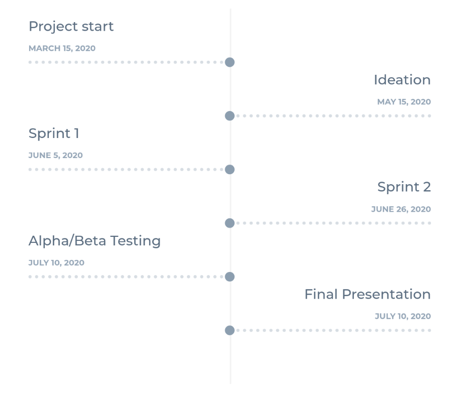

# ToDo Guru


ToDo Guru will help make your life more productive by organizing your tasks and reminding you when certain tasks should be worked on and completed.


## Table of Content
* [Concept](https://github.com/mobileappdevhm20/team-project-team_4/blob/gh-pages/README.md#concept)
* [Architecture](https://github.com/mobileappdevhm20/team-project-team_4/blob/gh-pages/README.md#architecture)
* [Tools](https://github.com/mobileappdevhm20/team-project-team_4/blob/gh-pages/README.md#tools)
* [Development](https://github.com/mobileappdevhm20/team-project-team_4/blob/gh-pages/README.md#development)
* [Learnings](#https://github.com/mobileappdevhm20/team-project-team_4/blob/gh-pages/README.md#learnings)
* [Demo](#https://github.com/mobileappdevhm20/team-project-team_4/blob/gh-pages/README.md#demo)
* [Links](#https://github.com/mobileappdevhm20/team-project-team_4/blob/gh-pages/README.md#links)


## Concept
The concept of the app is that it helps you to keep track of your tasks. It reminds so constantly that you have tasks that are not already done to improve your productivity and it also shows you tasks you already finished, to keep you motivated.

### Storyboard

### Prototyp
[Overview on Figma](https://www.figma.com/file/XoVCNBGzGf3GtRMCQAQIDV/prototype?node-id=0%3A1)
[Interactive showcase on Sketch](https://www.figma.com/proto/XoVCNBGzGf3GtRMCQAQIDV/prototype?node-id=0%3A1823&scaling=min-zoom)
[Overview on Figma](https://www.sketch.com/s/b24594e7-bbed-4fd7-af92-4ea9c37969a1)
[Interactive showcase on Sketch](https://www.sketch.com/s/b24594e7-bbed-4fd7-af92-4ea9c37969a1/a/QqywbY/play)


## Architecture
### Components


### Project Structure
```
root/

```

## Tools
 [](https://codecov.io/gh/mobileappdevhm20/team-project-team_4) [](https://sonarcloud.io/dashboard?id=mobileappdevhm20_team-project-team_4) [](https://github.com/mobileappdevhm20/team-project-team_4/blob/master/LICENSE)
* CI-Pipeline was built with [GitHub Actions](https://github.com/mobileappdevhm20/team-project-team_4/actions)
* Dependencies will be automatically updated with [renovatebot](https://app.renovatebot.com/dashboard#github/mobileappdevhm20/team-project-team_4)
* The code coverage will be automatically determined on each pull request via [codecov.io](https://codecov.io/gh/mobileappdevhm20/team-project-team_4)
* The code quality will also be automatically checked with [sonarcloud.io](https://sonarcloud.io/organizations/mobileappdevhm20/projects) and [ktlint](https://github.com/pinterest/ktlint) on each pull request


## Development


### Feature State
* TODO


## Learnings
* TODO


## Demo
TODO


## Links
* [Sprint 2 Presenation](https://docs.google.com/presentation/d/1onptqqwC0zfsclfpvAKzEf4_YOFf-ZvH7bKNGJNikvA/edit?usp=sharing)
* [Sprint 3 Presenation]()
* [Privacy Policy](privacy.html)
* [Terms & Conditions](terms_and_condition.html)
